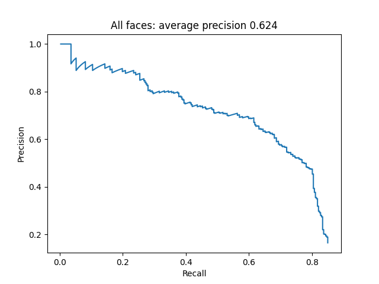
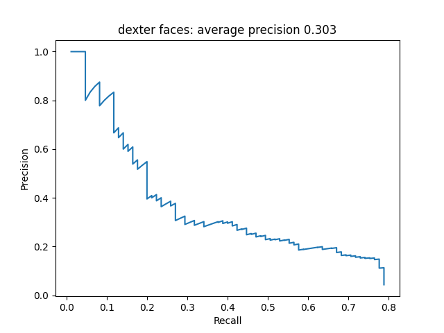
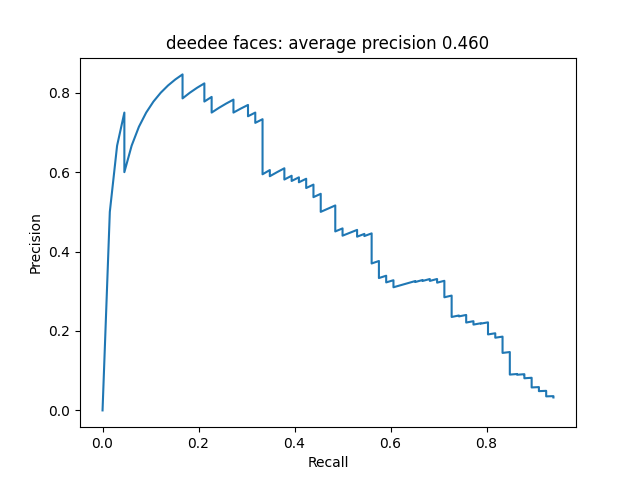
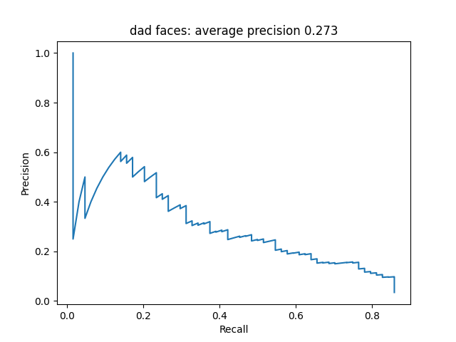
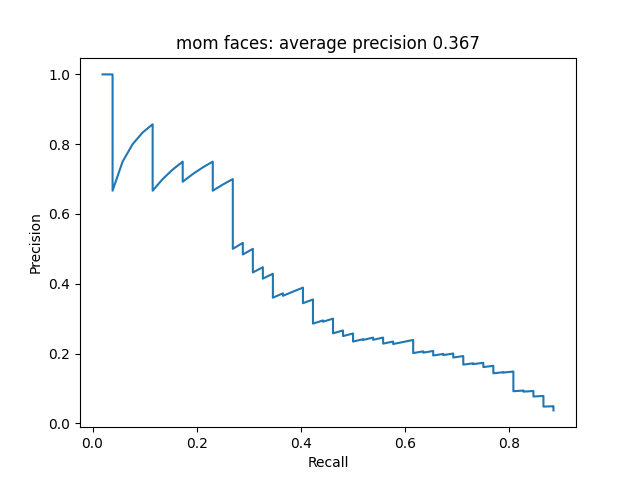

# 🥼 Facial Recognition in Cartoons  
**“Dexter's Laboratory”**

This project applies computer vision techniques to detect and recognize faces from the animated show *Dexter's Laboratory*. It involves two main tasks:

- ✅ Detecting all faces in cartoon images  
- ✅ Recognizing main characters: Dexter, DeeDee, Mom, and Dad

---

## 📌 Task 1 – Detect All Faces in Images

### 🔍 1.1 Generating Positive and Negative Examples

To train shape-based face classifiers, we used frames from the cartoon.

- **Positive samples**:
  - Faces were extracted with a 10px buffer and resized based on aspect ratio:
    - `rectangle_vertical`: (54, 66)
    - `square`: (54, 54)
    - `rectangle_horizontal`: (66, 54)

- **Negative samples**:
  - 3 random patches per image
  - Ensured patches have <10% IoU with any face region

📁 Final dataset structure:
```
data/
├── ExemplePozitive/     # rectangle_horizontal, rectangle_vertical, square
└── ExempleNegative/     # ~12,000 background/non-face patches
```

---

### 🧠 1.2 Feature Extraction with HOG Descriptors

Implemented in `RunProject.py` using `get_positive_descriptors(shape)`:

- **Data Augmentation** with [Albumentations](https://albumentations.ai/):
  - Gaussian blur, brightness/contrast, downscale, etc.
  - Horizontal flips
  - 2 augmented variants per image

- **Output saved to**:
  ```
  data/SalveazaFisiere/
  ```

---

### 🧪 1.3 Classifier Training

- Trained a separate model per face shape via `train_classifier(shape)`
- Models are saved in:
  ```
  data/SalveazaFisiere/
  ```

---

### 🧪 1.4 Face Detection on Test Images

- Detection logic in the `run()` function:
  - Multi-scale sliding window
  - Adaptive step size:
    - Smaller for small images
    - Larger for large images
  - Apply **Non-Maximum Suppression** (IoU > 30% removed)
  - Save detections and scores as `.npy` files

📈 **Detection Accuracy**:  
`62.4%` (based on precision/recall on 200 validation images)



---

## 📌 Task 2 – Recognition of Main Characters

### 🔍 2.1 Generating Positive & Negative Samples

- Positive examples grouped and resized by character:
  ```python
  self.character_sizes = {
      'mom': (120, 96),
      'dad': (96, 80),
      'deedee': (80, 112),
      'dexter': (96, 96)
  }
  ```
- Negative samples: 7000 random non-face patches per character

📁 Dataset structure:
```
data/
└── character_examples/
    ├── positive_examples/   # ~4,000–7,000 per character (with augmentation)
    └── negative_examples/   # 7,000 per character
```

---

### 🧠 2.2 Descriptor Generation & Classifier Training

- Same process as Task 1 using Albumentations + HOG
- Window sizes adjusted per character for optimal HOG performance
- Reused training pipeline — now **per character** instead of per shape

---

### 🧪 2.3 Character Recognition on Test Images

- Run detection using `CharacterFacialDetector.py`:
  - Slide character-specific window with `step = 1`
  - Use multi-scale detection
  - Apply **Non-Maximum Suppression**
  - Save results in:
    ```python
    result[character_name] = (detections, scores)
    ```

📈 **Recognition Accuracy per Character**:
- **Dexter**: 30.3%  
- **DeeDee**: 46%  
- **Dad**: 27.3%  
- **Mom**: 36.7%

  
  
  
  

---

## 🛠️ Technologies Used

- Python
- OpenCV
- Albumentations
- scikit-image (HOG)
- NumPy
